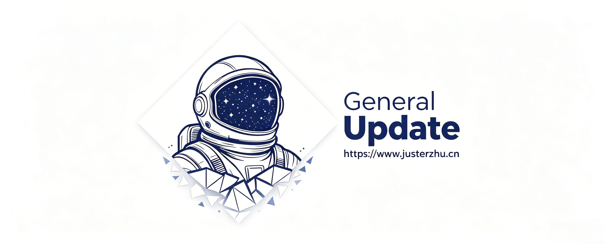

# GeneralUpdate #

**Unlimited Updates, Boundless Upgrades.** 

GeneralUpdate is a cross-platform application auto-upgrade component based on .NET Standard 2.0 and released under the Apache 2.0 License. 

It does not rely on any UI framework, minimizing resource consumption during updates.  

A one-click startup example helps you quickly understand how to integrate automatic upgrade capabilities into your application.

[中文](./README_ZHCN.md)

[If your company is currently using or planning to use [the product/service] and encountering any issues, or if you need assistance with selection, you are very welcome to join our discussion group for communication. Visit our official website for contact information: https://www.justerzhu.cn/ Developers, if you encounter urgent tasks, please explain the situation in advance, and your inquiries will be prioritized for resolution.]

<!-- SHIELD GROUP -->

  

  

**Share GeneralUpdate Repository**

  

Unlimited Updates, Boundless Upgrades.

## 🎏 Code Platforms

| Github                 | Gitee                 | GitCode                 |
| ---------------------- | --------------------- | ----------------------- |
|  |  |  |

## ❤️ Open Source Ecosystem

Special thanks to the authors of the following open source projects for contributing to the open source ecosystem [View example code](https://github.com/GeneralLibrary/GeneralUpdate-Samples/tree/main/UI).

| Name          | Supported UI Framework | Type            | Repository URL                                            |
| ------------- | ---------------------- | --------------- | --------------------------------------------------------- |
| Semi.Avalonia | Avalonia               | Control Library | [View](https://github.com/irihitech/Semi.Avalonia)        |
| Ursa.Avalonia | Avalonia               | Control Library | [View](https://github.com/irihitech/Ursa.Avalonia)        |
| WPFDevelopers | WPF                    | Control Library | [View](https://github.com/WPFDevelopersOrg/WPFDevelopers) |
| LayUI         | WPF                    | Control Library | [View](https://github.com/Layui-WPF-Team/Layui-WPF)       |
| AntdUI        | Winforms               | Control Library | [View](https://github.com/AntdUI/AntdUI)                  |

    

      <h1>RoutinAI</h1>
       
    

[RoutinAI](https://routin.ai/) is an enterprise-grade unified LLM API gateway that provides a single, type-safe interface to access over 100 leading large language models from the GPT, Claude, and Gemini families, including models such as gpt-5.4, claude-opus-4-6, and gemini-3.1-pro-preview. It eliminates the complexity of managing multiple AI vendors by providing zero-latency edge routing, seamless model switching without code modifications, unified billing, and centralized governance with spending caps and access policies.

## 🙏 Thanks

  
  
Thank JetBrains for providing free Rider IDE license.

## 🧙 Contributors

Thank you to all who have contributed to this project! You can view the [list of contributors](https://github.com/GeneralLibrary/GeneralUpdate/graphs/contributors) here.

## 🤝 Contributing

We warmly welcome all forms of contributions. If you're interested in contributing code, please contact me by submitting an issue and showcase your ideas.   We hope to create a tech-sharing community, an environment that promotes knowledge sharing, idea exchange, and mutual encouragement and collaboration.   We also welcome feedback on product features and user experience to help us improve GeneralUpdate.

**Organization Maintainer:** [@JusterZhu](https://github.com/JusterZhu)

## 📒 License

Copyright © 2023 [GeneralUpdate](https://github.com/GeneralLibrary/GeneralUpdate).  
This project is licensed under the [Apache 2.0](http://www.apache.org/licenses/) license.
