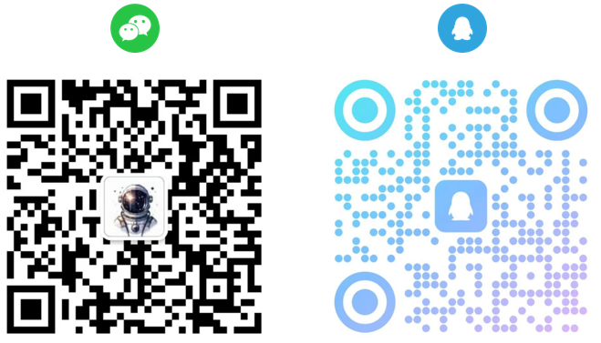

# GeneralUpdate #

**Unlimited Updates, Boundless Upgrades.** 

GeneralUpdate is a cross-platform application auto-upgrade component based on .NET Standard 2.0 and released under the Apache 2.0 License. 

It does not rely on any UI framework, minimizing resource consumption during updates.  

A one-click startup example helps you quickly understand how to integrate automatic upgrade capabilities into your application.

[中文](./README_ZHCN.md)

[If your company is currently using or planning to use [the product/service] and encountering any issues, or if you need assistance with selection, you are very welcome to join our discussion group for communication. The contact information can be found at the bottom of this page. Developers, if you encounter urgent tasks, please explain the situation in advance, and your inquiries will be prioritized for resolution.]

<!-- SHIELD GROUP -->

  

  

**Share GeneralUpdate Repository**

  

Unlimited Updates, Boundless Upgrades.

## 🐵AI Wiki

The Wiki content is automatically generated by Opendeep AI.  [View](https://opendeep.wiki/GeneralLibrary/GeneralUpdate)

## ❤️ Open Source Ecosystem

Special thanks to the authors of the following open source projects for contributing to the open source ecosystem [View example code](https://github.com/GeneralLibrary/GeneralUpdate-Samples/tree/main/UI).

| Name          | Supported UI Framework | Type            | Repository URL                                            |
| ------------- | ---------------------- | --------------- | --------------------------------------------------------- |
| Semi.Avalonia | Avalonia               | Control Library | [View](https://github.com/irihitech/Semi.Avalonia)        |
| Ursa.Avalonia | Avalonia               | Control Library | [View](https://github.com/irihitech/Ursa.Avalonia)        |
| WPFDevelopers | WPF                    | Control Library | [View](https://github.com/WPFDevelopersOrg/WPFDevelopers) |
| LayUI         | WPF                    | Control Library | [View](https://github.com/Layui-WPF-Team/Layui-WPF)       |
| AntdUI        | Winforms               | Control Library | [View](https://github.com/AntdUI/AntdUI)                  |

## 🎪 Infrastructure ##

| Name                  | Description                | Address                                                      |
| --------------------- | -------------------------- | ------------------------------------------------------------ |
| GeneralUpdate         | Automatic Updates          | [GitHub](https://github.com/GeneralLibrary/GeneralUpdate) [Gitee](https://gitee.com/GeneralLibrary/GeneralUpdate) [GitCode](https://gitcode.com/GeneralLibrary/GeneralUpdate) |
| GeneralUpdate.Maui    | Maui Updates (Android)     | [GitHub](https://github.com/GeneralLibrary/GeneralUpdate.Maui) [Gitee](https://gitee.com/GeneralLibrary/GeneralUpdate.Maui) [GitCode](https://gitcode.com/GeneralLibrary/GeneralUpdate-Maui) |
| GeneralUpdate.Tools   | Update Patch Creation Tool | [GitHub](https://github.com/GeneralLibrary/GeneralUpdate.Tools) [Gitee](https://gitee.com/GeneralLibrary/GeneralUpdate.Tools) [GitCode](https://gitcode.com/GeneralLibrary/GeneralUpdate-Tools) |
| GeneralUpdate-Samples | Usage Examples             | [GitHub](https://github.com/GeneralLibrary/GeneralUpdate-Samples) [Gitee](https://gitee.com/GeneralLibrary/GeneralUpdate-Samples) [GitCode](https://gitcode.com/GeneralLibrary/GeneralUpdate-Samples) |

## 🛸 Quick Start

| Name                   | Description                                                  | Address                                                      |
| ---------------------- | ------------------------------------------------------------ | ------------------------------------------------------------ |
| Quick Start            | Quick startup guide.                                         | [View](https://www.justerzhu.cn/docs/quickstart/quikstart)   |
| Example Code           | Example codes related to automatic upgrades and one-click startup scripts are here. | [View](https://github.com/GeneralLibrary/GeneralUpdate-Samples/tree/main/src) |
| Online Documentation   | Address of all related documentation for the component.      | [View](https://www.justerzhu.cn/)                            |
| Tutorial Videos        | Demonstration videos to help understand usage.               | [View](https://www.bilibili.com/video/BV1c8iyYZE7P)          |
| Release Notes          | Description of each version iteration.                       | [View](https://www.justerzhu.cn/docs/releaselog/releaselog)  |
| Technical Consultation | Contact the author to join the discussion group; please ask questions in the discussion group or issue so that everyone can see and avoid duplicate answers. | [View](https://www.justerzhu.cn/Profile)                     |

## 🚲 Supported Features

| Feature                     | Supported      | Notes                                                        |
| --------------------------- | -------------- | ------------------------------------------------------------ |
| Resume Downloads            | Yes            | If a single update fails, continue downloading on the next startup. (Default for referenced components) |
| Version-by-Version Updates  | Yes            | If the current client version is multiple versions behind the server, updates will be performed sequentially based on release dates. (Default for referenced components) |
| Binary Differential Updates | Yes            | Generates patch files using differential algorithms by comparing old and new versions. (Default for referenced components) |
| Incremental Update Function | Yes            | Only updates files that have been modified compared to the previous version and deletes files that do not exist in the current version. (Default for referenced components) |
| Forced Updates              | Yes            | Directly enforce an update after opening the client.         |
| Multiple Branch Updates     | Yes            | When a product has multiple branches, update corresponding content based on different branches. |
| Latest Version Push         | Yes            | Implemented based on SignalR to push the current latest version. |
| Multi-language              | To be verified | The component can also be written as a console application to update applications in other languages. |
| Skip Updates                | Yes            | Supports injecting pop-ups to let users decide whether to update the current release; server-side forced updates will not take effect. |
| Mutual Upgrades             | Yes            | The main program can update the upgrade program, and the upgrade program can update the main program. |
| Blacklist                   | Yes            | Skips files and file extensions listed in the blacklist during the update process. |
| OSS                         | Yes            | Simplified updates; it is a standalone update mechanism. Just place the version.json configuration file in the file server. The component will update and download based on the version information in the configuration file. |
| Rollback and Backup         | Yes            | Backups local client files before the update. If the client fails to start or crashes, it will roll back and overwrite. |
| Driver Updates              | To be verified | Backups drivers locally before updating. If the client fails to start or crashes, it will roll back and overwrite. |
| Custom Method List          | Yes            | Injects a collection of custom methods that will be executed before starting the update. If any exceptions occur during the execution of the custom method list, they will be notified via exception subscriptions. (Recommended to check the current software environment before the update) |
| AOT                         | Yes            | Supports AOT compilation release.                            |
| Identity authentication     | Yes            | Identity authentication supports HTTP requests to server resources and can pass (token) identity authentication information. |

## ✨ Supported Frameworks

| .NET Framework Name          | Supported |
| ---------------------------- | --------- |
| .NET Core 2.0                | Yes       |
| .NET 5 ... to latest version | Yes       |
| .NET Framework 4.6.1         | Yes       |

| UI Framework Name | Supported                                |
| ----------------- | ---------------------------------------- |
| WPF               | Yes                                      |
| UWP               | Not updatable in store mode              |
| MAUI              | Currently supports only Android platform |
| Avalonia          | Yes                                      |
| WinUI             | Yes                                      |
| Console           | Yes                                      |
| WinForms          | Yes                                      |

## 🐳 Operating Systems

| Operating System Name                | Supported |
| ------------------------------------ | --------- |
| Windows                              | Yes       |
| Android (.NET MAUI)                  | Yes       |
| Kirin V10 (Feiteng S2500)            | Yes       |
| Kirin V10 (Feiteng FT-2000)          | Yes       |
| Kirin V10 (x64)                      | Yes       |
| Ubuntu 24.04.1 LTS                   | Yes       |
| Loongson (Loongnix LoongArch 3A6000) | Yes       |
| Huawei Euler (EulerOS - Kunpeng)     | Yes       |
| Apple Mac (M1)                       | Yes       |
| Tongxin UOS (x64)                    | Yes       |

## 📞Contact us

- E-Mail : zhuzhen723723@outlook.com
- Wechat /  Tencent QQ

## 🎏 Code Platforms

| Github                 | Gitee                 | GitCode                 |
| ---------------------- | --------------------- | ----------------------- |
|  |  |  |

## 🧙 Contributors

Thank you to all who have contributed to this project! You can view the [list of contributors](https://github.com/GeneralLibrary/GeneralUpdate/graphs/contributors) here.

## 🤝 Contributing

We warmly welcome all forms of contributions. If you're interested in contributing code, please contact me by submitting an issue and showcase your ideas.   We hope to create a tech-sharing community, an environment that promotes knowledge sharing, idea exchange, and mutual encouragement and collaboration.   We also welcome feedback on product features and user experience to help us improve GeneralUpdate.

**Organization Maintainer:** [@JusterZhu](https://github.com/JusterZhu)

## 📒 License

Copyright © 2023 [GeneralUpdate](https://github.com/GeneralLibrary/GeneralUpdate).  
This project is licensed under the [Apache 2.0](http://www.apache.org/licenses/) license.
