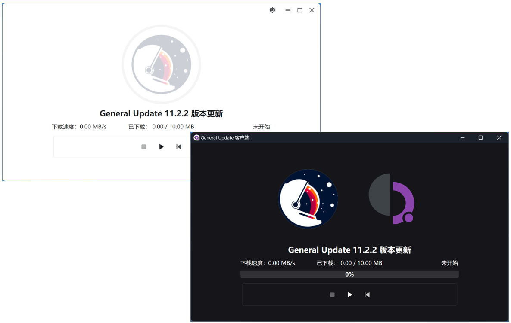
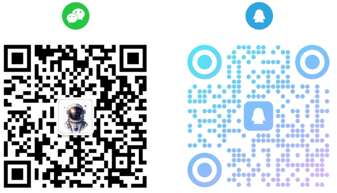

# GeneralUpdate #

**更新无限，升级无界。** 

GeneralUpdate是一款基于.NET Standard2.0 Apache 2.0协议开源的跨平台应用程序自动升级组件。 

不依赖任何UI框架，减少更新产生的资源消耗。  

一键启动示例帮助您快速理解如何为您的应用程序集成自动升级能力。

[English](./README.md)

【如果您所在的企业正在或准备使用遇到任何问题、选型非常欢迎进入讨论组进行沟通，联系方式在本页面底部。开发人员如果遇到紧急任务，请提前说明情况，您的询问将优先得到解决。】

<!-- SHIELD GROUP -->

  

  

**Share GeneralUpdate Repository**

  

Unlimited Updates, Boundless Upgrades.

## ❤️开源生态

非常感谢以下开源项目的作者参与了开源生态 [查看示例代码](https://github.com/GeneralLibrary/GeneralUpdate-Samples/tree/main/UI)。

| 名称          | 支持UI框架 | 类型   | 仓库地址                                                  |
| ------------- | ---------- | ------ | --------------------------------------------------------- |
| Semi.Avalonia | Avalonia   | 控件库 | [进入](https://github.com/irihitech/Semi.Avalonia)        |
| Ursa.Avalonia | Avalonia   | 控件库 | [进入](https://github.com/irihitech/Ursa.Avalonia)        |
| WPFDevelopers | WPF        | 控件库 | [进入](https://github.com/WPFDevelopersOrg/WPFDevelopers) |
| LayUI         | WPF        | 控件库 | [进入](https://github.com/Layui-WPF-Team/Layui-WPF)       |
| AntdUI        | Winforms   | 控件库 | [进入](https://github.com/AntdUI/AntdUI)                  |

## 🎪基础设施 ##

| 名称                  | 说明                 | 地址                                                         |
| --------------------- | -------------------- | ------------------------------------------------------------ |
| GeneralUpdate         | 自动更新升级         | [Github](https://github.com/GeneralLibrary/GeneralUpdate) [Gitee](https://gitee.com/GeneralLibrary/GeneralUpdate) [GitCode](https://gitcode.com/GeneralLibrary/GeneralUpdate) |
| GeneralUpdate.Maui    | Maui自动更新（安卓） | [Github](https://github.com/GeneralLibrary/GeneralUpdate.Maui) [Gitee](https://gitee.com/GeneralLibrary/GeneralUpdate.Maui) [GitCdoe](https://gitcode.com/GeneralLibrary/GeneralUpdate-Maui) |
| GeneralUpdate.Tools   | 更新补丁包制作工具   | [Github](https://github.com/GeneralLibrary/GeneralUpdate.Tools) [Gitee](https://gitee.com/GeneralLibrary/GeneralUpdate.Tools) [GitCode](https://gitcode.com/GeneralLibrary/GeneralUpdate-Tools) |
| GeneralUpdate-Samples | 使用示例             | [Github](https://github.com/GeneralLibrary/GeneralUpdate-Samples) [Gitee](https://gitee.com/GeneralLibrary/GeneralUpdate-Samples) [GitCode](https://gitcode.com/GeneralLibrary/GeneralUpdate-Samples) |

## 🛸快速启动

| 名称     | 说明                                                         | 地址                                                         |
| -------- | ------------------------------------------------------------ | ------------------------------------------------------------ |
| 快速启动 | 快速启动引导说明。                                           | [进入](https://www.justerzhu.cn/docs/quickstart/quikstart)   |
| 示例代码 | 自动升级相关的示例代码和一键启动脚本都在这里。               | [进入](https://github.com/GeneralLibrary/GeneralUpdate-Samples/tree/main/src) |
| 在线文档 | 关于组件所有的相关说明文档地址。                             | [进入](https://www.justerzhu.cn/)                            |
| 教程视频 | 通过视频操作演示帮助大家理解使用。                           | [进入](https://www.bilibili.com/video/BV1c8iyYZE7P)          |
| 发布日志 | 每次版本迭代的说明。                                         | [进入](https://www.justerzhu.cn/docs/releaselog/releaselog)  |
| 技术咨询 | 联系作者加入讨论组，请在讨论组或issue提问大家都能看到避免重复回答问题。 | [进入](https://www.justerzhu.cn/Profile)                     |

## 🚲支持功能

| 功能           | 是否支持 | 备注                                                         |
| -------------- | -------- | ------------------------------------------------------------ |
| 断点续传       | 支持     | 单次更新失败时，下次一次启动时继续上一次更新下载更新包内容。（引用组件默认生效） |
| 逐版本更新     | 支持     | 客户端当前版本如果与服务器相差多个版本，则根据多个版本的发布日期逐个更新。（引用组件默认生效） |
| 二进制差分更新 | 支持     | 对比新老版本通过差分算法生成补丁文件。（引用组件默认生效）   |
| 增量更新功能   | 支持     | 相比上一个版本只更新当前修改过的文件，并且删除当前版本不存在的文件。（引用组件默认生效） |
| 强制更新       | 支持     | 打开客户端之后直接强制更新。                                 |
| 多分支更新     | 支持     | 当一个产品有多个分支时，需要根据不同的分支更新对应的内容。   |
| 最新版本推送   | 支持     | 基于Signal R实现，推送当前最新版本。                         |
| 多语言         | 待验证   | 也可将本组件编写为控制台程序，作为更新“脚本”。更新其他语言的应用程序。 |
| 跳过更新       | 支持     | 支持注入弹窗让用户决定是否更新本次发布，服务端决定强制时更新不生效。 |
| 相互升级       | 支持     | 主程序可更新升级程序，升级程序可更新主程序。                 |
| 黑名单         | 支持     | 在更新过程中会跳过黑名单中的文件列表和文件扩展名列表。       |
| OSS            | 支持     | 极简化更新，是一套独立的更新机制。只需要在文件服务器中放置version.json的版本配置文件。组件会根据配置文件中的版本信息进行更新下载。 |
| 回滚、备份     | 支持     | 更新之前会将客户端本地文件备份，如果客户端启动失败或崩溃则回滚覆盖。 |
| 驱动更新       | 待验证   | 更新之前会将驱动备份到本地，如果客户端启动失败或崩溃则回滚覆盖。 |
| 自定义方法列表 | 支持     | 注入一个自定义方法集合，该集合会在更新启动前执行。执行自定义方法列表如果出现任何异常，将通过异常订阅通知。（推荐在更新之前检查当前软件环境） |
| AOT            | 支持     | 支持AOT编译发布。                                            |
| 身份认证       | 支持     | HTTP请求服务器资源可传递（token）身份认证信息。              |

## ✨支持框架

| .NET框架名称               | 是否支持 |
| -------------------------- | -------- |
| .NET Core 2.0              | 支持     |
| .NET 5 ... to last version | 支持     |
| .NET Framework 4.6.1       | 支持     |

| UI框架名称 | 是否支持              |
| ---------- | --------------------- |
| WPF        | 支持                  |
| UWP        | 商店模式下不可更新    |
| MAUI       | 目前仅支持Android平台 |
| Avalonia   | 支持                  |
| WinUI      | 支持                  |
| Console    | 支持                  |
| WinForms   | 支持                  |

## 🐳操作系统

| 操作系统名称 | 是否支持 |
| ------------ | -------- |
| Windows      | 支持     |
| Android (.NET MAUI) | 支持 |
| 麒麟V10(飞腾S2500)  | 支持   |
| 麒麟V10(飞腾FT-2000)  | 支持   |
| 麒麟V10(x64)  | 支持   |
| Ubuntu 24.04.1 LTS | 支持 |
| 龙芯(Loongnix LoongArch 3A6000) | 支持 |
| 华为欧拉(EulerOS-鲲鹏Kunpeng) | 支持 |
| Apple Mac (M1) | 支持 |
| 统信UOS (x64) | 支持 |

## 📞联系我们

- E-Mail : zhuzhen723723@outlook.com
- Wechat /  Tencent QQ

## 🎏代码平台

| Github                 | Gitee                 | GitCode                 |
| ---------------------- | --------------------- | ----------------------- |
|  |  |  |

## 🧙贡献者

感谢所有为该项目做出贡献的人！您可以在这里查看 [贡献者列表](https://github.com/GeneralLibrary/GeneralUpdate/graphs/contributors)。

## 🤝 参与贡献

我们非常欢迎各种形式的贡献。如果你对贡献代码感兴趣，可以通过提出issue的方式与我取得联系，大展身手，向我们展示你的奇思妙想。 我们希望创建一个技术分享型社区，一个可以促进知识共享、想法交流，激发彼此鼓励和协作的环境。 同时欢迎联系我们提供产品功能和使用体验反馈，帮助我们将 GeneralUpdate 建设得更好。

**组织维护者:** [@JusterZhu](https://github.com/JusterZhu)

## 📒License

Copyright © 2023 [GeneralUpdate](https://github.com/GeneralLibrary/GeneralUpdate).
This project is [Apache 2.0](http://www.apache.org/licenses/) licensed.
