# GeneralUpdate.Core — 执行流程详解

> **目标读者：** 第一次接触 GeneralUpdate.Core 的开发者
>
> **阅读完你将理解：**
> - 更新系统的整体架构和分层设计
> - 从 App 启动到更新完成的完整执行链路
> - Client 和 Upgrade 两个进程各自的职责
> - Chain（差分）和 Full（全量）包的选择逻辑和执行差异
> - 中间件管道的设计和工作原理
> - Chain 失败时自动 Full 回退的容错机制
> - IPC 通信如何跨进程传递更新任务
> - Silent Mode 延迟更新的设计意图

---

## 目录

1. [架构总览](#1-架构总览)
2. [入口：Bootstrap 的双重身份设计](#2-入口bootstrap-的双重身份设计)
3. [ClientStrategy：完整的更新流程](#3-clientstrategy完整的更新流程)
4. [DownloadPlanBuilder：下载计划与 Chain/Full 决策](#4-downloadplanbuilder下载计划与-chainfull-决策)
5. [下载引擎：DefaultDownloadOrchestrator](#5-下载引擎defaultdownloadorchestrator)
6. [中间件管道：Hash → Compress → Patch](#6-中间件管道hash--compress--patch)
7. [DiffPipeline：差分引擎内部揭秘](#7-diffpipeline差分引擎内部揭秘)
8. [Chain→Full 回退机制](#8-chainfull-回退机制)
9. [IPC 通信协议](#9-ipc-通信协议)
10. [UpdateStrategy：Upgrade 进程的执行流程](#10-updatestrategyupgrade-进程的执行流程)
11. [Silent Mode：延迟升级机制](#11-silent-mode延迟升级机制)
12. [OS 策略的平台差异](#12-os-策略的平台差异)
13. [错误恢复全景](#13-错误恢复全景)
14. [关键代码路径索引](#14-关键代码路径索引)

---

## 1. 架构总览

### 1.1 三层架构

GeneralUpdate.Core 采用**三层调度 + 两层引擎**的设计：

```
┌──────────────────────────────────────────────────────────┐
│                   第一层：入口调度                          │
│              GeneralUpdateBootstrap                       │
│    根据 AppType 分发到不同的角色策略                        │
├──────────────────────────────────────────────────────────┤
│                   第二层：角色策略                          │
│  ┌─────────────┐  ┌──────────────┐  ┌───────────────┐    │
│  │ClientStrategy│  │UpdateStrategy│  │ OssStrategy   │    │
│  │  下载+调度    │  │  读IPC+应用   │  │   OSS 模式    │    │
│  └──────┬──────┘  └──────┬───────┘  └───────┬───────┘    │
│         │                │                  │             │
│         └────────────────┼──────────────────┘             │
│                          ▼                                │
│                   第三层：OS 策略                           │
│  ┌──────────────┐ ┌─────────────┐ ┌─────────────┐        │
│  │WindowsStrategy│ │LinuxStrategy│ │ MacStrategy │        │
│  └──────┬───────┘ └──────┬──────┘ └──────┬──────┘        │
│         │                │               │                │
│         └────────────────┼───────────────┘                │
│                          ▼                                │
│                   中间件管道（每个版本独立执行）              │
│              Hash → Compress → Patch                      │
├──────────────────────────────────────────────────────────┤
│                   两层引擎                                 │
│  ┌─────────────────────┐  ┌─────────────────────────┐     │
│  │  下载引擎            │  │  差分引擎               │     │
│  │  DefaultDownload     │  │  DiffPipeline          │     │
│  │  Orchestrator        │  │  + HDiffPatch          │     │
│  │  + 重试策略           │  │  + 并行补丁应用          │     │
│  └─────────────────────┘  └─────────────────────────┘     │
└──────────────────────────────────────────────────────────┘
```

### 1.2 核心设计原则

| 原则 | 说明 |
|------|------|
| **Client 统一下载** | 所有包（Client + Upgrade + Chain + Full 的 ZIP）都在 Client 进程中一次性下载到 `%TEMP%/main_temp/` |
| **Upgrade 只应用** | Upgrade 进程不做任何网络请求，通过加密 IPC 文件接收版本信息，只运行中间件管道 |
| **链式回退** | Chain（差分）包应用失败时，自动用已预下载的 Full 包原地重试，不需要第二次服务端请求 |
| **中间件管道** | 每个版本独立走一次 `Hash → Compress → Patch` 管道，单一职责、可测试、可替换 |

### 1.3 两种包类型

| 类型 | PackageType | 内容 | 应用方式 |
|------|-------------|------|----------|
| **Chain（差分）** | 1 | `.patch` 二进制差分文件 + 新增文件 + 删除清单 | 解压到临时 `PatchPath` → 安装在目录的旧文件 + .patch 通过 HDiffPatch 合成新文件 |
| **Full（全量）** | 2 | 完整的应用文件 | 直接解压覆盖安装目录，跳过 PatchMiddleware |

### 1.4 两种进程角色

| 进程 | AppType | 入口 Strategy | 职责 |
|------|---------|---------------|------|
| 主程序（如 `MyApp.exe`） | `Client` | `ClientStrategy` | 服务端版本校验、一次性下载所有包、原地升级自身（Upgrade 包）、写 IPC 文件、拉起 Upgrade 进程、退出 |
| 升级程序（如 `Updater.exe`） | `Upgrade` | `UpdateStrategy` | 读 IPC 文件获取版本信息、运行管道升级主程序文件、写回 manifest、拉起主程序、退出 |

---

## 2. 入口：Bootstrap 的双重身份设计

`GeneralUpdateBootstrap` 是整个更新库的入口点。它的构造函数在**任何其他方法调用之前**就会尝试读取 IPC 文件。

### 2.1 构造函数即 IPC 探测

```csharp
public GeneralUpdateBootstrap()
{
    InitializeFromEnvironment(); // 读取加密 IPC 文件
}
```

`InitializeFromEnvironment()` 做的事情：

```csharp
void InitializeFromEnvironment()
{
    var provider = new EncryptedFileProcessContractProvider();
    var contract = provider.Receive();  // 读 %TEMP%/GeneralUpdate/ipc/process_info.enc

    if (contract == null) return; // 没有 IPC 文件 → 这不是一个 Upgrade 进程

    // 读到 IPC 文件 → 说明是 Upgrade 进程
    // 用 IPC 中的信息填充内部配置
    _configInfo.UpdateAppName = contract.AppName;
    _configInfo.InstallPath = contract.InstallPath;
    _configInfo.UpdateVersions = contract.UpdateVersions;
    // ... 其他字段
}
```

### 2.2 LaunchAsync 分发

```
                    ┌─────────────────────────┐
                    │   构造函数               │
                    │   InitializeFromEnv()    │
                    └────────────┬────────────┘
                                 │
                    ┌────────────┴────────────┐
                    │  读取 IPC 文件           │
                    └────────────┬────────────┘
                                 │
                    ┌────────────┴────────────┐
                    │  有 IPC?                │
                    └────────────┬────────────┘
                         │               │
                         No              Yes
                         │               │
                   ┌─────▼──┐      ┌──────▼─────┐
                   │无 IPC  │      │有 IPC      │
                   │数据    │      │数据已填充   │
                   └────┬───┘      └──────┬─────┘
                        │                 │
                   ┌────▼────┐      ┌─────▼────┐
                   │SetConfig│      │ LaunchAsy│
                   │或       │      │ nc(AppTyp│
                   │SetSource│      │ e.Upgrade)│
                   │填充配置  │      │ → Update │
                   └────┬────┘      │ Strategy │
                        │           └──────────┘
                   ┌────▼────┐
                   │ LaunchAs│
                   │ync(AppTy│
                   │pe.Client│
                   │)→Client │
                   │Strategy │
                   └─────────┘
```

### 2.3 关键理解

**同一个 `GeneralUpdateBootstrap` 类型，在两种进程中有完全不同的执行路径：**

```
Client 进程:
  new GeneralUpdateBootstrap()
    → InitializeFromEnvironment() → 没有 IPC 文件 → _configInfo 为空
  .SetConfig(request)             → _configInfo 从用户代码设置
  .LaunchAsync(AppType.Client)    → ClientStrategy

Upgrade 进程:
  new GeneralUpdateBootstrap()
    → InitializeFromEnvironment() → 读到 IPC 文件 → _configInfo 已填充
  .LaunchAsync(AppType.Upgrade)   → UpdateStrategy（直接用构造函数中填充的配置）
```

**这意味着 Upgrade 进程不需要任何命令行参数或配置文件。** 所有信息通过 IPC 文件传递。

---

## 3. ClientStrategy：完整的更新流程

`ClientStrategy` 是最复杂的角色策略，负责从版本校验到拉起升级进程的完整链路。

### 3.1 全流程总图

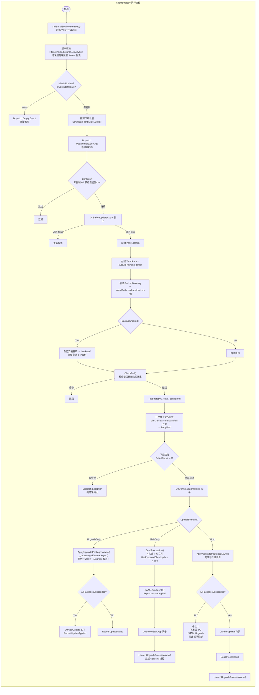

### 3.2 步骤详解

#### Step 1：清理冲突进程（CallSmallBowlHomeAsync）

```csharp
// ClientStrategy.cs:985-1002
// 在开始更新前，杀掉正在运行的升级进程（Bowl）
// 防止它们持有文件锁，导致后续备份或替换失败
private async Task CallSmallBowlHomeAsync(string processName)
{
    var processes = Process.GetProcessesByName(processName);
    foreach (var process in processes)
        await GracefulExit.ShutdownAsync(process);
}
```

#### Step 2：版本校验

```csharp
// 构造下载源（默认 HTTP）
var downloadSource = new HttpDownloadSource(
    _configInfo.UpdateUrl,       // 服务端 URL
    _configInfo.ClientVersion,   // 主程序当前版本
    _configInfo.UpgradeClientVersion, // 升级程序当前版本
    _configInfo.AppSecretKey,    // 应用密钥
    GetPlatform(),               // 平台类型
    // ... 其他参数
);

// 请求服务端获取可用更新
var sourceResult = await downloadSource.ListAsync();
```

服务端返回 `List<DownloadAsset>`，每个 Asset 包含：
- `Name`：包名，也是 ZIP 文件名（如 `1.0.1`）
- `Version`：版本号
- `Url`：下载地址
- `SHA256`：哈希校验值
- `Size`：文件大小
- `PackageType`：1=Chain, 2=Full
- `AppType`：1=Client, 2=Upgrade
- `IsFreeze`：是否冻结（冻结包不参与更新）
- `IsForcibly`：是否强制更新
- `MinClientVersion`：最低兼容版本
- `FallbackFullName/Url/Hash/Version`：对应的回退 full 包信息

#### Step 3：场景判定

```csharp
var scenario = (_configInfo.IsMainUpdate, _configInfo.IsUpgradeUpdate) switch
{
    (false, false) => UpdateScenario.None,        // 不需要更新
    (false, true)  => UpdateScenario.UpgradeOnly,  // 只需更新升级程序
    (true, false)  => UpdateScenario.MainOnly,     // 只需更新主程序
    (true, true)   => UpdateScenario.Both,         // 两者都要更新
};
```

#### Step 4：备份

```csharp
// 备份安装目录到 .backups/
StorageManager.Backup(_configInfo.InstallPath, _configInfo.BackupDirectory, blacklist);
// 清理旧备份，只保留最近 3 个
StorageManager.CleanBackup(_configInfo.InstallPath, keepVersions: 3);
```

黑名单配置默认排除：`.backups`、`.git`、`.svn`、`bin`、`obj`、`node_modules` 等目录。

#### Step 5：一次性下载所有包

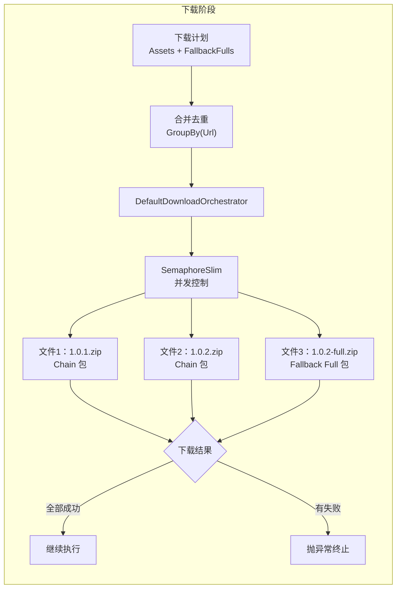

```csharp
// ClientStrategy.cs:589-597
// 合并链包和回退包，去重后一次性下载
var allAssets = plan.Assets.Concat(plan.FallbackFulls)
                          .GroupBy(a => a.Url)
                          .Select(g => g.First())
                          .ToList();
var mergedPlan = new DownloadPlan(allAssets, plan.IsForcibly);
var downloadReport = await ExecuteDownloadAsync(mergedPlan);

if (downloadReport.FailedCount > 0)
    throw new InvalidOperationException("下载失败！");
```

**关键点：** Chain 包和对应的 Fallback Full 包**同时下载**，不存在"先下 chain 失败再下 full"的两阶段重试。这样设计是为了更好的用户体验——下载失败可以立即重试整个批次，而不是一次一次试。

#### Step 6：场景分发

三种场景的执行路径：

```
┌─────────────────────────────────────────────────────────────────┐
│ UpgradeOnly                                                      │
│                                                                  │
│  ApplyUpgradePackagesAsync()                                     │
│    ↓                                                             │
│  _osStrategy.Create(_configInfo)                                 │
│    ↓                                                             │
│  _osStrategy.ExecuteAsync()                                      │
│    ↓                                                             │
│  OS 策略对每个 upgrade 版本：Hash → Compress → Patch             │
│    ↓                                                             │
│  AllPackagesSucceeded → WriteBackUpgradeVersion()                │
└─────────────────────────────────────────────────────────────────┘

┌─────────────────────────────────────────────────────────────────┐
│ MainOnly                                                         │
│                                                                  │
│  SendProcessIpc()                                                │
│    ↓                                                             │
│  写 AES 加密 IPC 文件到 %TEMP%/GeneralUpdate/ipc/process_info.enc│
│    ↓                                                             │
│  LaunchUpgradeProcessAsync()                                     │
│    ↓                                                             │
│  拉起 Upgrade 进程 → 当前 Client 进程继续运行或退出               │
└─────────────────────────────────────────────────────────────────┘

┌─────────────────────────────────────────────────────────────────┐
│ Both                                                             │
│                                                                  │
│  ApplyUpgradePackagesAsync()  ─── 先升级自身                      │
│    ↓ 失败则中止                                                   │
│  SendProcessIpc()              ─── 再写 IPC                      │
│    ↓                                                             │
│  LaunchUpgradeProcessAsync()   ─── 最后拉起 Upgrade 进程          │
└─────────────────────────────────────────────────────────────────┘
```

---

## 4. DownloadPlanBuilder：下载计划与 Chain/Full 决策

`DownloadPlanBuilder` 是一个静态工具类，负责从服务端返回的 Asset 列表中构建出最终要下载哪些包。

### 4.1 完整决策流程

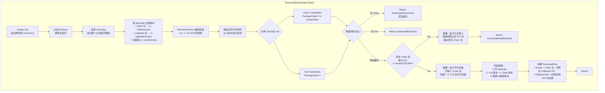

### 4.2 换包阈值逻辑详解

80% 阈值的核心代码：

```csharp
// DownloadPlanBuilder.cs:174-196
if (chainCandidates.Count > 0 && fullCandidates.Count > 0)
{
    // 取版本最大的 Full 包作为参考
    var bestFull = fullCandidates.OrderByDescending(v => v).First();

    // 计算同 AppType 的 Chain 包总大小
    long chainTotal = chainCandidates
        .Where(a => a.AppType == bestFull.AppType)
        .Sum(a => a.Size);

    // 如果 Chain 总和 >= Full 的 80%
    if (chainTotal >= (long)(bestFull.Size * 0.8))
    {
        // 直接用 Full 包，下载量更少、更可靠
        return new DownloadPlan(new[] { bestFull }, isForcibly);
    }
}
```

**为什么要有这个阈值？**

| 场景 | Chain 大小 | Full 大小 | 比例 | 决策 | 原因 |
|------|-----------|-----------|------|------|------|
| 只改了少量代码 | 1 MB | 50 MB | 2% | Chain | 差分节省 98% 流量 |
| 大量文件变更 | 42 MB | 50 MB | 84% | **Full** | 差分只省 16%，不值得增加复杂度和风险 |
| 新增较多文件 | 35 MB | 50 MB | 70% | Chain | 省 30%，值得 |

### 4.3 回退包匹配规则

当 Chain 总大小 < 80% Full 大小时，走 Chain + FallbackFull 模式：

```csharp
// DownloadPlanBuilder.cs:204-237
var chainWithFallback = chainCandidates.Select(chain =>
{
    // 找到同 AppType、版本 >= chain 版本的最小 Full 包
    var match = fullCandidates
        .Where(f => f.AppType == chain.AppType)
        .OrderBy(f => f.Version)           // 最小版本优先
        .FirstOrDefault(f => f.Version >= chain.Version);

    if (match != null)
    {
        // 给这个 Chain 包附上 FallbackFull 元信息
        return chain with
        {
            FallbackFullName    = match.Name,
            FallbackFullUrl     = match.Url,
            FallbackFullHash    = match.SHA256,
            FallbackFullVersion = match.Version
        };
    }
    return chain; // 没有匹配的 Full 包，那就没有回退能力
});
```

---

## 5. 下载引擎：DefaultDownloadOrchestrator

### 5.1 架构

```
ClientStrategy
     │
     ▼
IDownloadOrchestrator (接口)
     │
     ├── DefaultDownloadOrchestrator (默认实现)
     │       │
     │       ├── IDownloadPolicy      → 重试策略（退避算法）
     │       ├── IDownloadExecutor    → 实际 HTTP 下载
     │       └── IDownloadPipeline    → 下载后处理（SHA256 校验）
     │
     └── 自定义 Orchestrator（可替换）
```

### 5.2 执行逻辑

```mermaid
flowchart TB
    subgraph ORCH["DefaultDownloadOrchestrator.ExecuteAsync()"]
        O_IN["DownloadPlan + TempPath"] --> O_CONCUR["确定并发度\n• Serial 模式 → 1\n• 正常模式 → Clamp(Options, 1, CPU*2)"]

        O_CONCUR --> O_SEM["创建 SemaphoreSlim(concurrency)"]

        O_SEM --> O_LOOP["对每个 DownloadAsset"]

        O_LOOP --> O_WAIT["等待 Semaphore 槽位\n超时 1 分钟"]

        O_WAIT -- "超时" --> O_FAIL["标记为失败"]

        O_WAIT -- "获得槽位" --> O_NAME["解析文件名\n{Name}{Format}\n如 1.0.1.zip"]

        O_NAME --> O_HTTP["HttpDownloadExecutor.DownloadAsync()\n支持 HTTP Range 断点续传"]

        O_HTTP --> O_VERIFY["下载后处理管道\n默认 = SHA256 校验"]

        O_VERIFY --> O_CHECK{"Hash 匹配?"}

        O_CHECK -- "匹配" --> O_OK["标记成功"]
        O_CHECK -- "不匹配" --> O_RETRY["触发重试策略\n指数退避\n默认最多重试 3 次"]

        O_RETRY --> O_HTTP
        O_RETRY -- "超过重试次数" --> O_FAIL

        O_OK --> O_RELEASE["释放 Semaphore"]
        O_FAIL --> O_RELEASE

        O_RELEASE --> O_NEXT["下一个 Asset"]

        O_NEXT --> O_REPORT["所有 Asset 完成\n汇总 DownloadReport\nSuccessCount / FailedCount"]
    end
```

### 5.3 关键设计点

**断点续传：** 使用 HTTP Range 请求头，如果下载中断，只下载缺失的部分。

**重试策略：**
- 默认最多重试 3 次
- 间隔 = `RetryInterval * 2^(N-1)` （指数退避）
- 默认初始间隔 1 秒

**并发度控制：**
- `DiffMode.Serial` → 强制串行
- 正常模式 → `Clamp(MaxConcurrency, 1, Environment.ProcessorCount * 2)`

---

## 6. 中间件管道：Hash → Compress → Patch

中间件管道是 GeneralUpdate.Core 的核心处理模式。每个版本独立走一次完整的管道。

### 6.1 管道构建

管道由 OS 策略构建：

```csharp
// WindowsStrategy.cs
protected override PipelineBuilder BuildPipeline(PipelineContext context)
{
    var needsPatch = context.Get<bool>("PatchEnabled")
                    && context.Get<int>("PackageType") != (int)PackageType.Full;

    return new PipelineBuilder(context)
        .UseMiddleware<HashMiddleware>()       // 1. 完整性校验
        .UseMiddleware<CompressMiddleware>()   // 2. 解压
        .UseMiddlewareIf<PatchMiddleware>(     // 3. 差分应用（仅 Chain 包）
            needsPatch: needsPatch);
}
```

### 6.2 PipelineContext：中间件之间的数据契约

`PipelineContext` 是一个 `ConcurrentDictionary<string, object>`，所有中间件通过它交换数据：

| Key | 写入者 | 消费者 | 说明 |
|-----|--------|--------|------|
| `ZipFilePath` | AbstractStrategy | HashMiddleware, CompressMiddleware | ZIP 完整路径 `TempPath/{name}.zip` |
| `Hash` | AbstractStrategy | HashMiddleware | 预期的 SHA256 |
| `Format` | AbstractStrategy | CompressMiddleware | 压缩格式（当前仅 Zip） |
| `Encoding` | AbstractStrategy | CompressMiddleware | 文件编码 |
| `SourcePath` | AbstractStrategy | CompressMiddleware, PatchMiddleware | 安装目录 |
| `PatchPath` | AbstractStrategy | CompressMiddleware, PatchMiddleware | Chain 包临时解压目录 |
| `PatchEnabled` | AbstractStrategy | OS 策略（BuildPipeline 时） | 是否启用差分 |
| `PackageType` | AbstractStrategy | OS 策略, CompressMiddleware | 1=Chain, 2=Full |
| `DiffPipeline` | AbstractStrategy | PatchMiddleware | 并行差分引擎 |

### 6.3 Chain 和 Full 的执行差异

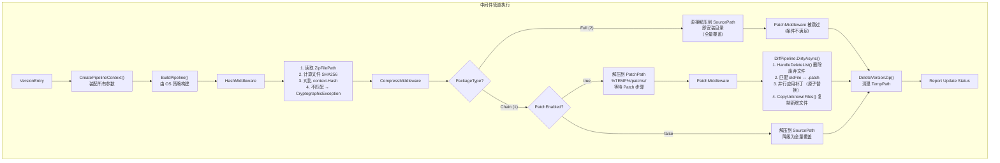

### 6.4 各中间件详细实现

#### HashMiddleware

```csharp
public async Task InvokeAsync(PipelineContext context)
{
    var zipPath = context.Get<string>("ZipFilePath");
    var expectedHash = context.Get<string>("Hash");

    var actualHash = ComputeSHA256(zipPath); // 计算 ZIP 文件 SHA256

    if (!string.Equals(actualHash, expectedHash, StringComparison.OrdinalIgnoreCase))
        throw new CryptographicException("文件哈希不匹配！");
}
```

#### CompressMiddleware

```csharp
public async Task InvokeAsync(PipelineContext context)
{
    var packageType = context.Get<int>("PackageType");
    var zipPath = context.Get<string>("ZipFilePath");
    var sourcePath = context.Get<string>("SourcePath");
    var patchPath = context.Get<string>("PatchPath");
    var patchEnabled = context.Get<bool>("PatchEnabled");
    var format = context.Get<Format>("Format");
    var encoding = context.Get<Encoding>("Encoding");

    if (packageType == (int)PackageType.Full)
    {
        // Full 包 → 直接解压到安装目录
        CompressProvider.Decompress(zipPath, sourcePath, format, encoding);
    }
    else if (patchEnabled)
    {
        // Chain 包 + 启用补丁 → 解压到 PatchPath
        CompressProvider.Decompress(zipPath, patchPath, format, encoding);
    }
    else
    {
        // Chain 包 + 禁用补丁 → 降级为全量解压
        CompressProvider.Decompress(zipPath, sourcePath, format, encoding);
    }
}
```

#### PatchMiddleware

```csharp
public async Task InvokeAsync(PipelineContext context)
{
    var sourcePath = context.Get<string>("SourcePath");
    var patchPath = context.Get<string>("PatchPath");
    var diffPipeline = context.Get<DiffPipeline>("DiffPipeline");

    // 调用差分引擎应用补丁
    await diffPipeline.DirtyAsync(sourcePath, patchPath,
        progress: new DiffProgressReporter(this),
        cancellationToken: CancellationToken.None);
}
```

### 6.5 管道执行的主循环

OS 策略（`AbstractStrategy`）负责遍历所有版本并运行管道：

```csharp
// AbstractStrategy.cs:149-287
public async Task ExecuteAsync()
{
    foreach (var version in _configinfo.UpdateVersions)
    {
        var context = CreatePipelineContext(version, patchPath);
        var pipelineBuilder = BuildPipeline(context);
        await pipelineBuilder.Build(); // 跑中间件管道
        DeleteVersionZip(version);    // 删除已处理的 ZIP
    }
}
```

**注意：** 一个版本的失败不影响其他版本的处理。但 `AllPackagesSucceeded` 标记会告诉调用方是否有任何版本失败。

---

## 7. DiffPipeline：差分引擎内部揭秘

`DiffPipeline` 是 GeneralUpdate 的差分引擎，提供两个操作模式：
- **CleanAsync**：服务端用——比较新旧版本目录，生成 `.patch` 文件
- **DirtyAsync**：客户端用——应用 `.patch` 文件到已安装目录

### 7.1 主流程

```mermaid
flowchart TB
    subgraph CLEAN["CleanAsync — 服务端生成补丁"]
        C_IN["sourcePath (旧版本目录)\ntargetPath (新版本目录)\npatchPath (输出目录)"]

        C_IN --> C_VALIDATE["ValidateDirectories()\n验证三个目录都存在"]

        C_VALIDATE --> C_COMPARE["_cleanMatcher.Compare(source, target)\n→ DifferentNodes (变更文件)\n→ LeftNodes (旧版文件索引)"]

        C_COMPARE --> C_SEM["SemaphoreSlim(MaxDegreeOfParallelism)\n默认并行度 = 2"]

        C_SEM --> C_LOOP["对每个变更文件"]

        C_LOOP --> C_MATCH["_cleanMatcher.Match(file, leftNodes)\n找到旧版本中对应的文件"]

        C_MATCH --> C_FOUND{"找到旧文件?"}

        C_FOUND -- "有旧文件" --> C_HASH{"HashEquals(old, new)?"}
        C_HASH -- "哈希一致" --> C_SKIP["跳过——内容未变\n不生成补丁"]
        C_HASH -- "不同" --> C_SIZE["ValidateFileSize()\n检查 MaxInputFileSize 限制"]
        C_SIZE --> C_DIFF["_binaryDiffer.CleanAsync(\n  old, new, tempPatchPath, ct)\n→ 生成 .patch 文件\n默认 = HDiffPatch 算法"]

        C_FOUND -- "无旧文件" --> C_COPY["File.Copy(new → patchPath)\n新文件直接复制"]

        C_COPY --> C_PROGRESS["report Progress\nInterlocked.Increment → DiffProgress"]
        C_DIFF --> C_PROGRESS
        C_SKIP --> C_PROGRESS

        C_PROGRESS --> C_NEXT["下一个文件"]

        C_NEXT --> C_EXCEPT["_cleanMatcher.Except(source, target)\n找出旧版有、新版删除的文件"]

        C_EXCEPT --> C_DELETE_JSON["序列化 generalupdate.delete.json\n每条记录：\n  相对路径\n  SHA256 哈希"]
    end
```

```mermaid
flowchart TB
    subgraph DIRTY["DirtyAsync — 客户端应用补丁"]
        D_IN["appPath (已安装的旧版本目录)\npatchPath (补丁目录)"]

        D_IN --> D_DELETE["HandleDeleteList()"]

        D_DELETE --> D_DEL_FIND["在 patchPath 中找\ngeneralupdate.delete.json"]
        D_DEL_FIND --> D_DEL_PARSE["反序列化 → List<FileNode>"]
        D_DEL_PARSE --> D_DEL_HASH["构建 SHA256 HashSet\nO(1) 匹配"]

        D_DEL_HASH --> D_DEL_SCAN["遍历 appPath 中的文件\n（排除 .patch 文件）"]
        D_DEL_SCAN --> D_DEL_CHECK{"文件 SHA256\n在 HashSet 中?"}

        D_DEL_CHECK -- Yes --> D_DEL_EXEC["File.SetAttributes(Normal)\nFile.Delete()"]
        D_DEL_CHECK -- No --> D_DEL_SKIP["跳过"]

        D_DEL_EXEC --> D_MATCH
        D_DEL_SKIP --> D_MATCH

        D_MATCH["_dirtyMatcher.Match(oldFile, patchFiles)\n为每个安装目录文件匹配对应的 .patch 文件"]

        D_MATCH --> D_SEM["SemaphoreSlim(MaxDegreeOfParallelism)"]

        D_SEM --> D_LOOP["对每个匹配对\n(oldFile, patchFile)"]

        D_LOOP --> D_APPLY["ApplyPatch(oldFile, patchFile)"]

        D_APPLY --> D_TEMP["生成随机临时文件路径\nPath.Combine(dir, RandomFileName_oldFileName)"]

        D_TEMP --> D_BIN["_binaryDiffer.DirtyAsync(\n  oldFilePath, tempPath, patchFilePath, ct)\nHDiffPatch 逆向应用"]

        D_BIN --> D_ATOMIC["原子替换"]
        D_ATOMIC --> D_ATOMIC_1["1. File.SetAttributes(old, Normal)"]
        D_ATOMIC_1 --> D_ATOMIC_2["2. File.Delete(old)"]
        D_ATOMIC_2 --> D_ATOMIC_3["3. File.Move(temp, old)"]

        D_ATOMIC --> D_PROGRESS["report Progress"]

        D_PROGRESS --> D_NEXT["下一个文件"]

        D_NEXT --> D_UNKNOWN["CopyUnknownFiles(appPath, patchPath)"]

        D_UNKNOWN --> D_UNKNOWN_CMP["对比 appPath vs patchPath\n找 patchPath 中有、appPath 中没有的文件"]
        D_UNKNOWN_CMP --> D_UNKNOWN_FILTER["排除黑名单格式\n如 .patch, .json"]
        D_UNKNOWN_FILTER --> D_UNKNOWN_PATH["计算相对路径\nStartsWith + Substring\n防 Path Traversal"]
        D_UNKNOWN_PATH --> D_UNKNOWN_COPY["同样 temp → atomic replace 策略"]
        D_UNKNOWN_COPY --> D_UNKNOWN_CLEANUP["删除 patchPath 目录"]
    end
```

### 7.2 原子替换策略（ApplyPatch）

```csharp
private async Task ApplyPatch(string appFilePath, string patchFilePath, CancellationToken ct)
{
    // 1. 生成随机临时文件名
    var tempPath = Path.Combine(
        Path.GetDirectoryName(appFilePath)!,
        $"{Path.GetRandomFileName()}_{Path.GetFileName(appFilePath)}");

    // 2. 应用 HDiffPatch → 写入临时文件
    await _binaryDiffer.DirtyAsync(appFilePath, tempPath, patchFilePath, ct);

    // 3. 原子替换
    if (File.Exists(tempPath))
    {
        File.SetAttributes(appFilePath, FileAttributes.Normal); // 处理只读文件
        File.Delete(appFilePath);                                // 删除原文件
        File.Move(tempPath, appFilePath);                        // 临时文件→正式位置
    }
}
```

**为什么需要原子替换？**

```
❌ 直接覆写：
   写入到一半进程崩溃 → 文件半损坏 → 程序无法启动

✅ 临时文件策略：
   1. 完全写入临时文件（如果崩溃，原文件完好无损）
   2. 删除原文件
   3. Move 临时文件到正式位置
   如果第 2 步和第 3 步之间崩溃 → 文件可能丢失
   但这对后续更新是安全的——下次更新会重新下载
```

### 7.3 删除文件识别策略

删除不是按文件名匹配，而是按文件内容的 SHA256 哈希匹配：

```csharp
// 从 generalupdate.delete.json 读取被删除文件的哈希列表
// 扫描当前安装目录，计算每个文件的 SHA256
// 如果匹配 → 删除

var deleteHashes = new HashSet<string>(/* 从 JSON 读取 */);
foreach (var file in appFiles)
{
    var fileHash = hashAlgorithm.ComputeHash(file.FullName);
    if (deleteHashes.Contains(fileHash))
        File.Delete(file.FullName);
}
```

**好处：** 即使文件被重命名，只要内容没变就不会误删。

### 7.4 并行控制

```csharp
using var semaphore = new SemaphoreSlim(_options.MaxDegreeOfParallelism); // 默认=2

var tasks = matchedPairs.Select(pair => Task.Run(async () =>
{
    await semaphore.WaitAsync(ct);
    try
    {
        await ApplyPatch(...);
    }
    catch (Exception ex) when (!_options.StopOnFirstError)
    {
        // StopOnFirstError=false(默认) → 单个文件失败不阻断整体
        // 通过 Progress 报告错误，继续处理其他文件
    }
    finally
    {
        semaphore.Release();
    }
}));

await Task.WhenAll(tasks);
```

---

## 8. Chain→Full 回退机制

这是 GeneralUpdate.Core 的最高级容错机制，在 `AbstractStrategy.ExecuteAsync()` 中实现。

### 8.1 完整流程

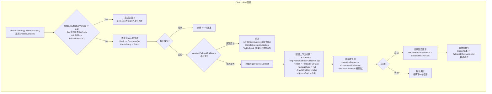

### 8.2 跳过后继 Chain 包的版本跟踪

```csharp
// AbstractStrategy.cs:168-185
SemVersion? fallbackEffectiveVersion = null;

foreach (var version in _configinfo.UpdateVersions)
{
    // 如果之前已经 Full 回退到某个版本
    // 跳过所有 <= 该版本的 Chain 包
    if (fallbackEffectiveVersion != null
        && version.PackageType == (int)PackageType.Chain
        && versionSv <= fallbackEffectiveVersion)
    {
        continue; // 已覆盖，跳过
    }

    try
    {
        await pipelineBuilder.Build(); // Chain 尝试
    }
    catch when (version.PackageType == Chain && FallbackFullName != null)
    {
        // Chain 失败 → 用 Full 重试
        await fallbackBuilder.Build();
        fallbackEffectiveVersion = ffv; // 记录回退版本
    }
}
```

### 8.3 边界场景示例

**场景：3 个 Chain 包，都回退到同一个 Full 包**

```
版本列表：1.0.1(chain), 1.0.2(chain), 1.0.3(chain)
Full 包： 1.0.3-full (作为所有 chain 的 FallbackFull)

执行：
1. 1.0.1 chain → 失败 → 回退到 1.0.3-full → fallbackEffectiveVersion = 1.0.3
2. 1.0.2 chain → 跳过（1.0.2 <= 1.0.3）
3. 1.0.3 chain → 跳过（1.0.3 <= 1.0.3）
```

**场景：部分 Chain 包失败，每个有不同 Full 包**

```
版本列表：1.0.1(chain, fallback=1.0.1-full), 1.0.2(chain, fallback=1.0.2-full)
执行：
1. 1.0.1 chain → 成功 → 继续
2. 1.0.2 chain → 失败 → 回退到 1.0.2-full → fallbackEffectiveVersion = 1.0.2
```

**场景：Chain 包成功，不需要回退**

```
版本列表：1.0.1(chain), 1.0.2(chain)
执行：
1. 1.0.1 chain → 成功
2. 1.0.2 chain → 成功
→ fallbackEffectiveVersion 始终为 null，无需跳过
```

---

## 9. IPC 通信协议

IPC（Inter-Process Communication）是 Client 进程和 Upgrade 进程之间的数据传输机制。

### 9.1 通信流程

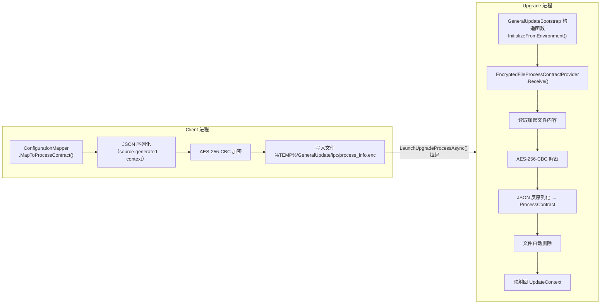

### 9.2 加密细节

```csharp
// IpcEncryption.cs
// 使用 AES-256-CBC 加密
// 密钥：SHA256("GeneralUpdate.ProcessContract.IPC.v1") → 32 字节
// IV：  固定 16 字节（起始 0x47，其余 0x00）
// 文件路径：%TEMP%/GeneralUpdate/ipc/process_info.enc

public static void EncryptToFile(byte[] plainBytes, string filePath, byte[] key, byte[] iv)
{
    using var aes = Aes.Create();
    aes.Key = key;
    aes.IV = iv;
    using var encryptor = aes.CreateEncryptor();
    var cipher = encryptor.TransformFinalBlock(plainBytes, 0, plainBytes.Length);

    // FileShare.Read 允许接收方在写入完成前开始读取
    using var fs = new FileStream(filePath, FileMode.Create, FileAccess.Write, FileShare.Read);
    fs.Write(cipher, 0, cipher.Length);
}
```

### 9.3 ProcessContract 字段映射

| ProcessContract | 来源 | 含义 | 消费方 |
|----------------|------|------|--------|
| `UpdateAppName` | `_configInfo.MainAppName` | 更新后要启动的程序的名称 | OS 策略的 StartAppAsync |
| `InstallPath` | `_configInfo.InstallPath` | 安装目录 | 管道的 SourcePath |
| `CurrentVersion` | `_configInfo.ClientVersion` | 当前主程序版本 | 日志/上报 |
| `LastVersion` | `_configInfo.LastVersion` | 目标版本 | 日志/上报 |
| `UpdateVersions` | `clientVersions` 列表 | 要应用的包列表 | 管道的输入 |
| `TempPath` | `main_temp` 目录 | ZIP 文件所在目录 | 管道的 ZipFilePath |
| `UpdatePath` | `_configInfo.UpdatePath` | Upgrade 程序所在目录 | 路径解析 |
| `Encoding` | `_configInfo.Encoding` | 文件编码 | CompressMiddleware |
| `CompressFormat` | `_configInfo.Format` | 压缩格式 | CompressMiddleware |
| `DownloadTimeOut` | `_configInfo.DownloadTimeOut` | 下载超时 | Orchestrator（预留） |
| `BackupDirectory` | `_configInfo.BackupDirectory` | .backups 目录 | 日志/上报 |
| `ReportUrl` | `_configInfo.ReportUrl` | 状态上报 URL | UpdateStrategy |
| `LaunchClientAfterUpdate` | `_configInfo.LaunchClientAfterUpdate` | 更新后是否自动启动主程序 | UpdateStrategy |
| `ReportType` | 1 或 2 | 1=主动轮询 2=推送通知 | 上报区分 |

---

## 10. UpdateStrategy：Upgrade 进程的执行流程

`UpdateStrategy` 是 Upgrade 进程的策略。与 `ClientStrategy` 最大的区别是：**它不做任何网络请求**。

### 10.1 完整流程

```mermaid
flowchart TB
    subgraph UPGRADE_EXEC["UpdateStrategy 执行流程"]
        START["GeneralUpdateBootstrap 构造\nInitializeFromEnvironment() 读 IPC"] --> OK{"IPC 文件有效?"}
        OK -- No --> EXIT_WAIT["退出等待\n（不是 Upgrade 进程）"]
        OK -- Yes --> LAUNCH["LaunchAsync(AppType.Upgrade)"]

        LAUNCH --> OS_CREATE["_osStrategy.Create(_configInfo)"]

        OS_CREATE --> HOOK_BEFORE["OnBeforeUpdateAsync 钩子"]
        HOOK_BEFORE --> HOOK_R{"返回 false?"}
        HOOK_R -- Yes --> EXIT_CANCEL["取消更新"]
        HOOK_R -- No --> EXECUTE["_osStrategy.ExecuteAsync()"]

        EXECUTE --> PIPELINE["对每个 Client 版本\n循环跑中间件管道"]

        PIPELINE --> CHK_RESULT{"AllPackagesSucceeded?"}

        CHK_RESULT -- Yes --> WRITE_MANIFEST["写回 generalupdate.manifest.json\n更新 ClientVersion"]

        WRITE_MANIFEST --> HOOK_AFTER["OnAfterUpdate 钩子"]

        HOOK_AFTER --> HOOK_START["OnBeforeStartApp 钩子"]
        HOOK_START --> LAUNCH_APP["_osStrategy.StartAppAsync()\n拉起主程序"]

        LAUNCH_APP --> GRACEFUL["GracefulExit.CurrentProcessAsync()\nUpgrade 进程退出"]

        CHK_RESULT -- No --> SKIP_LAUNCH["跳过主程序启动\n防止更新循环"]
    end
```

### 10.2 为什么 Upgrade 进程不做网络请求？

```csharp
// UpdateStrategy.cs 的核心逻辑
public async Task ExecuteAsync()
{
    // 没有调用 IDownloadSource.ListAsync()
    // 没有调用 IDownloadOrchestrator.ExecuteAsync()
    // 所有数据已经在 _configInfo 中，来自 IPC 文件

    // 直接跑管道
    _osStrategy.Create(_configInfo);
    await _osStrategy.ExecuteAsync();

    // 检查结果
    if ((_osStrategy as AbstractStrategy)?.AllPackagesSucceeded == true)
    {
        // 写回 manifest
        ManifestInfo.TryUpdateVersion(installPath, clientVersion: latestVersion);
        // 启动主程序
        await _osStrategy.StartAppAsync();
    }
    // 如果失败 → 不写 manifest、不启动主程序
    // 下次 Client 启动时会重新检测到更新
}
```

**设计意图：** Upgrade 进程是一个"短暂的一次性进程"。
- 它不需要网络能力（减小二进制体积）
- 它不需要知道服务端地址（安全：攻击面更小）
- 它只需要读本地文件并执行文件操作

### 10.3 防止更新循环

`AllPackagesSucceeded` 是一个重要的安全闸门：

```
Client 进程                          Upgrade 进程
     │                                    │
     ├─ 版本校验: 1.0.0 → 1.0.1           │
     ├─ 下载 1.0.1.zip                    │
     ├─ IPC → 拉起 Upgrade ──────→        │
     │                                    ├─ 应用 1.0.1 → ✅ 成功
     │                                    ├─ 写 manifest: 1.0.1
     │                                    └─ 启动主程序 1.0.1
     │                                         │
     └── 旧进程退出 ←─────────────────────────┘
                                               │
                                         新版本主程序启动
                                         版本号已是最新
```

如果 Upgrade 进程失败：

```
Upgrade 进程
     ├─ 应用 1.0.1 → ❌ 失败
     ├─ AllPackagesSucceeded = false
     ├─ 不写 manifest（版本号仍为 1.0.0）
     └─ 不启动主程序

    下次 Client 启动：
     ├─ 版本校验: 1.0.0 → 1.0.1（仍然需要更新）
     └─ 再次尝试
```

---

## 11. Silent Mode：延迟升级机制

Silent Mode 是标准更新流程的一种变体，唯一的区别是**启动升级进程的时机从"立即"变成了"进程退出时"**。

### 11.1 标准模式 vs 静默模式

```
标准模式：
  [下载 → IPC → 立起 Upgrade → 退出] → Upgrade 运行 → 启动主程序

静默模式：
  [下载 → IPC → 用户继续工作 → 进程退出 → 拉起 Upgrade] → Upgrade 运行 → 启动主程序
```

静默模式的流程是相同的，只是被拆成了两段：

```
PollLoopAsync (后台线程):
  ClientStrategy.ExecuteAsync() → HasPreparedClientUpdate = true → IPC 已写入 → 循环退出
  （此时用户完全无感知，继续正常使用应用）

AppDomain.ProcessExit (进程退出时):
  SilentPollOrchestrator.OnProcessExit → LaunchUpgradeProcessSync()
  → Upgrade 进程启动 → 应用更新 → 下次启动时版本已更新
```

### 11.2 完整流程图

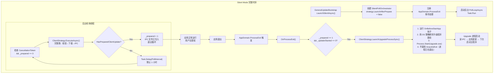

### 11.3 TryLaunchUpgrade — 兜底方法

```csharp
// SilentPollOrchestrator.cs:187-210
// 如果 AppDomain.ProcessExit 不可靠（如 Ctrl+C）
// 可以手动调用这个方法拉起升级进程
public bool TryLaunchUpgrade()
{
    if (_prepared != 1 || Interlocked.Exchange(ref _updaterStarted, 1) == 1)
        return false;

    _strategy.LaunchUpgradeProcessSync();
    return true;
}
```

---

## 12. OS 策略的平台差异

| 方面 | Windows | Linux | macOS |
|------|---------|-------|-------|
| **管道构建** | `Hash→Compress→Patch(IfNeeded)` | 同上 | 同上 |
| **启动主程序** | 拉起应用 + 可选 Bowl 守护进程 → `GracefulExit.CurrentProcessAsync()` | 只拉起应用 → `GracefulExit` | 只拉起应用，额外 `File.Exists` 验证 |
| **路径大小写** | 不敏感 | 敏感 | 不敏感（APFS 默认） |
| **Bowl 支持** | ✅ 支持崩溃守护 | ❌ | ❌ |

Bowl 是一个 Windows-only 的崩溃守护进程。当主程序意外退出时，Bowl 可以检测到并重新拉起。在更新流程中，Bowl 会被 ClientStrategy 的 `CallSmallBowlHomeAsync()` 先杀死以避免文件锁。

---

## 13. 错误恢复全景

| 错误场景 | 捕获位置 | 处理方式 | 后果 |
|----------|----------|----------|------|
| **下载失败** | `ClientStrategy.DownloadAndApplyAsync()` | 检查 `FailedCount > 0`，抛异常 | 冒泡到 `ExecuteAsync()` catch → 触发错误钩子 + 上报失败 |
| **Chain 包管道失败（有 FallbackFull）** | `AbstractStrategy.ExecuteAsync()` catch when | **重建 PipelineContext**，设置 PackageType=Full，重新跑 Hash→Compress | 最终更新成功，`fallbackEffectiveVersion` 记录回退版本 |
| **Chain 包管道失败（无 FallbackFull）** | `AbstractStrategy.ExecuteAsync()` catch | `AllPackagesSucceeded=false`，触发 `HandleExecuteException`，如果还没成功过则 `TryRollback()` | 该版本失败，继续下一个版本 |
| **Fallback Full 也失败** | `AbstractStrategy.ExecuteAsync()` catch (内层 try) | `AllPackagesSucceeded=false`，继续下一个版本 | 该版本失败 |
| **Upgrade 包失败（Both 场景）** | `ClientStrategy.cs` Both 分支 | **中止** IPC 发送 + Upgrade 进程启动 | 防止 Upgrade 进程拿到失效的 TempPath |
| **Upgrade 进程管道失败** | `UpdateStrategy.ExecuteAsync()` | `AllPackagesSucceeded=false`，跳过 manifest 写回，跳过主程序启动 | 下次 Client 启动重新检测到更新 |
| **Rollback 失败** | `AbstractStrategy.TryRollback()` | 只打日志，不阻断 | 安装目录可能处于不一致状态 |
| **ZIP 哈希不匹配** | `HashMiddleware` | `CryptographicException` | 该版本管道立即失败，触发 Chain→Full 回退或版本失败 |
| **文件被锁定** | `IpcEncryption.DecryptFromFile()` | 捕获 `IOException`，返回 null | IPC 文件未就绪，Upgrade 进程等待或退出 |

### Rollback 的逻辑

```csharp
// AbstractStrategy.cs:504-532
private void TryRollback()
{
    // 只在"当前批次还没有任何版本成功"时调用
    // 如果某个版本已经成功应用并覆盖了文件，
    // 回退会撤销有效的工作，造成跨版本的降级

    if (!_appliedAnyVersion)
    {
        // 尝试从 .backups/ 恢复
        StorageManager.Restore(backupDir, _configInfo.InstallPath);
    }
}
```

---

## 14. 关键代码路径索引

| 步骤 | 文件 | 关键行 |
|------|------|--------|
| 入口分发 | `Bootstrap/GeneralUpdateBootstrap.cs` | `LaunchAsync()` @L125 |
| Upgade 路径 IPC 读取 | `Bootstrap/GeneralUpdateBootstrap.cs` | `InitializeFromEnvironment()` @L357 |
| Client 角色完整工作流 | `Strategy/ClientStrategy.cs` | `ExecuteStandardWorkflowAsync()` @L396 |
| 场景判定 | `Strategy/ClientStrategy.cs` | Scenario switch @L452-458 |
| 一次性下载 | `Strategy/ClientStrategy.cs` | `DownloadAndApplyAsync()` @L589-597 |
| 原地升级 Upgrade 包 | `Strategy/ClientStrategy.cs` | `ApplyUpgradePackagesAsync()` @L723-737 |
| IPC 写文件 | `Strategy/ClientStrategy.cs` | `SendProcessIpc()` @L751-765 |
| 拉起 Upgrade 进程 | `Strategy/ClientStrategy.cs` | `LaunchUpgradeProcessAsync()` @L777-789 |
| 下载计划构建 | `Download/DownloadPlanBuilder.cs` | `Build()` @L111 |
| Chain vs Full 阈值决策 | `Download/DownloadPlanBuilder.cs` | @L174-196 |
| 回退包匹配 | `Download/DownloadPlanBuilder.cs` | @L200-238 |
| 默认下载编排 | `Download/Orchestrators/DefaultDownloadOrchestrator.cs` | `ExecuteAsync()` |
| 并行管道循环 + Chain→Full 回退 | `Strategy/AbstractStrategy.cs` | `ExecuteAsync()` @L149-287 |
| 管道上下文装配 | `Strategy/AbstractStrategy.cs` | `CreatePipelineContext()` @L322-346 |
| Windows 管道构建 | `Strategy/WindowsStrategy.cs` | `BuildPipeline()` |
| Hash 校验中间件 | `Pipeline/HashMiddleware.cs` | `InvokeAsync()` |
| 解压中间件（chain/full 分支） | `Pipeline/CompressMiddleware.cs` | `InvokeAsync()` |
| 补丁应用中间件 | `Pipeline/PatchMiddleware.cs` | `InvokeAsync()` |
| 服务端差分生成 | `Pipeline/DiffPipeline.cs` | `CleanAsync()` |
| 客户端差分支应用 | `Pipeline/DiffPipeline.cs` | `DirtyAsync()` |
| 原子替换 | `Pipeline/DiffPipeline.cs` | `ApplyPatch()` |
| 删除文件处理 | `Pipeline/DiffPipeline.cs` | `HandleDeleteList()` |
| 新增文件复制 | `Pipeline/DiffPipeline.cs` | `CopyUnknownFiles()` |
| 加密写文件 | `Ipc/IpcEncryption.cs` | `EncryptToFile()` |
| 解密读文件 | `Ipc/IpcEncryption.cs` | `DecryptFromFile()` |
| IPC Provider | `Ipc/IProcessInfoProvider.cs` | `EncryptedFileProcessContractProvider` |
| ProcessContract 定义 | `Configuration/ProcessContract.cs` | 全部字段 |
| Configuration 映射 | `Configuration/ConfigurationMapper.cs` | `MapToProcessContract()` |
| 静默模式轮询 | `Silent/SilentPollOrchestrator.cs` | `PollLoopAsync()` @L116 |
| 静默模式退出时拉起 | `Silent/SilentPollOrchestrator.cs` | `OnProcessExit()` @L156 |
| Upgrade 角色 | `Strategy/UpdateStrategy.cs` | `ExecuteAsync()` |
| 管道上下文数据契约 | `Pipeline/PipelineContext.cs` | ConcurrentDictionary |
| OS 策略解析 | `Bootstrap/OsStrategyResolver.cs` | `Resolve()` / `GetPlatform()` |
| 事件管理器 | `Event/EventManager.cs` | `Dispatch()` / `AddListener()` |
| 差分进度桥接 | `Pipeline/DiffProgressReporter.cs` | `Report()` |

---

> 这份文档涵盖了 GeneralUpdate.Core 的完整执行流程。如果你发现任何不准确或需要补充的地方，请提交 Issue 或 PR。
